## Praktikum 1: Menyiapkan Lingkungan Pengembangan
1. Instalasi Git
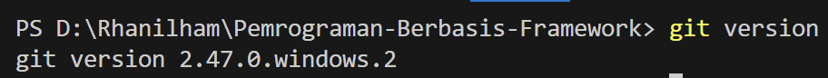
2. Instalasi VS Code
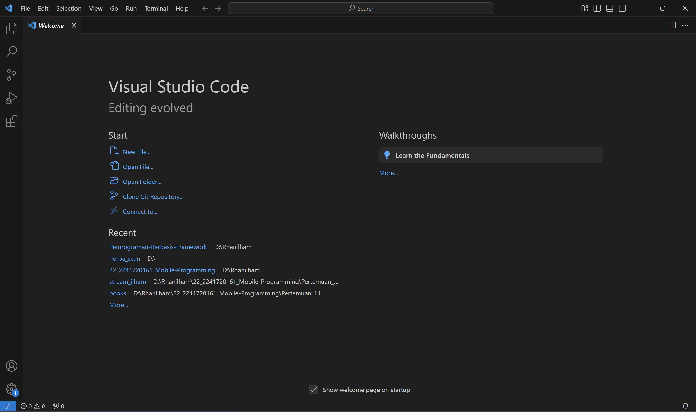
3. Instalasi NodeJS
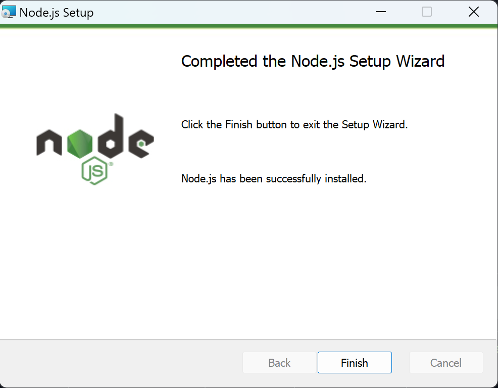

**Pertanyaan Praktikum 1**
1. Jelaskan kegunaan masing-masing dari Git, VS Code dan NodeJS yang telah Anda install pada sesi praktikum ini!
    1. Git

        Git adalah sistem kontrol versi yang digunakan untuk melacak perubahan dalam kode sumber suatu proyek. Dengan Git, pengembang dapat:
        - Menyimpan riwayat perubahan kode
        - Berkolaborasi dengan tim melalui platform seperti ```GitHub``` atau ```GitLab```
        - Mengelola berbagai versi kode menggunakan ```branching``` dan ```merging```
        - Memudahkan rollback ke versi sebelumnya jika terjadi kesalahan

    2. VS Code (Visual Studio Code)

        VS Code adalah editor kode sumber yang ringan namun kaya fitur, digunakan untuk menulis dan mengedit kode. Beberapa keunggulannya:
        - Mendukung berbagai bahasa pemrograman dengan ```ekstensi```
        - Memiliki fitur ```IntelliSense``` untuk saran kode yang cerdas
        - Terintegrasi dengan ```Git``` untuk version control langsung dari editor
        - Menyediakan ```terminal bawaan``` untuk menjalankan perintah tanpa keluar dari editor

    3. Node.js

        Node.js adalah runtime JavaScript berbasis ```V8 engine``` yang memungkinkan JavaScript berjalan di luar browser. Node.js digunakan untuk:
        - Mengembangkan aplikasi backend menggunakan ```JavaScript```
        - Menjalankan server web dengan framework seperti ```Express.js```
        - Mengelola dependensi proyek melalui ```npm (Node Package Manager)```
        - Membangun aplikasi real-time seperti ```chat``` dan ```streaming data```
        
2. Buktikan dengan screenshoot yang menunjukkan bahwa masing-masing tools tersebut
telah berhasil terinstall di perangkat Anda!


## Praktikum 2: Membuat Proyek Pertama React Menggunakan Next.js
1. Membuat folder proyek baru dengan nama ```belajar-react```. Melalui konsol/command
prompt/CMD masuk ke dalam folder tersebut dan jalankan perintah ini:

    ```npx create-next-app```
2. Buat proyek baru dengan nama ```hello-world``` seperti di bawah ini. Nama proyek ini perlu
dimasukkan pertama kali melalui konsol.
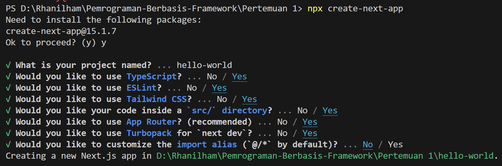
3. Buka folder proyek hello-world menggunakan VS Code. Masuk ke dalam folder proyek helloworld dengan perintah:

    ```cd hello-world```

    Kemudian setelah masuk ke folder hello-world, masukkan perintah:

    ```code .```

    Maka VS Code akan membuka project react Anda yang telah dibuat bernama ```hello-world```.
    Dan akan menampilkan struktur folder proyek seperti di bawah ini.

    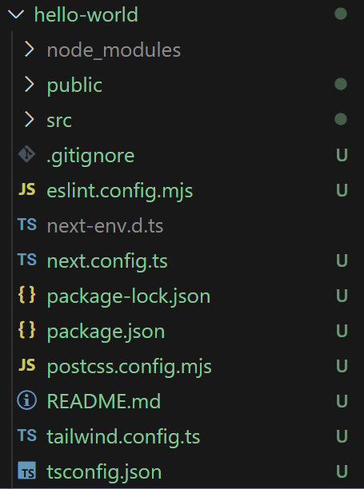
4. Running proyek hello-world dengan memasukkan perintah di bawah ini melalui konsol atau
terminal di dalam VS Code.

    ```npm run dev```
    
    Tunggu proses kompilasi hingga selesai. Lalu Anda dapat membuka alamat localhost di browser: http://localhost:3000/
    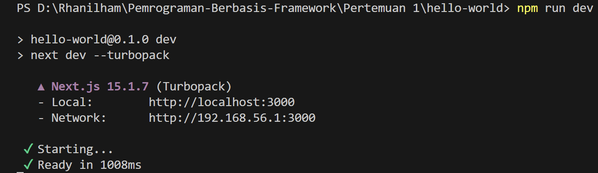
    
    Jika di browser telah tampil seperti gambar berikut ini, Selamat!
    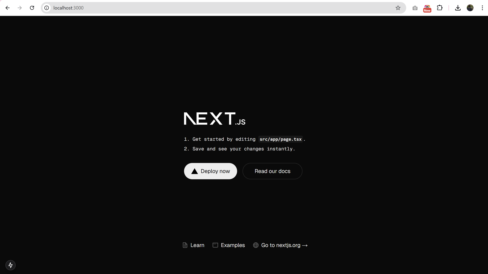

**Pertanyaan Praktikum 2**
1. Pada Langkah ke-2, setelah membuat proyek baru menggunakan Next.js, terdapat beberapa
istilah yang muncul. Jelaskan istilah tersebut, TypeScript, ESLint, Tailwind CSS, App
Router, Import alias, dan Turbopack!
    1. TypeScript
        
        TypeScript adalah superset dari JavaScript yang menambahkan fitur tipe statis untuk mendeteksi kesalahan lebih awal dan meningkatkan keterbacaan serta pemeliharaan kode.

    2. ESLint
        
        ESLint adalah alat untuk mendeteksi dan memperbaiki kesalahan sintaks serta memastikan konsistensi kode dalam proyek JavaScript atau TypeScript.

    3. Tailwind CSS
        
        Tailwind CSS adalah framework CSS berbasis utility-first yang memungkinkan pengembang membuat desain antarmuka dengan cepat menggunakan class bawaan tanpa perlu menulis CSS kustom.

    4. App Router
        
        App Router adalah sistem routing baru di Next.js yang berbasis file dalam folder app/, menggantikan sistem Pages Router (pages/), dan mendukung fitur seperti server components serta layout nesting.

    5. Import Alias
        
        Import alias memungkinkan penggunaan path pendek untuk mengimpor file dalam proyek, sehingga lebih mudah dikelola. Misalnya:

        ```import Button from '@/components/Button';```

        Alih-alih menggunakan path panjang seperti:
        
        ```import Button from '../../components/Button';```

    6. Turbopack

        Turbopack adalah bundler baru di Next.js yang lebih cepat dibanding Webpack. Ini digunakan untuk pengembangan lokal agar proses build dan hot reload lebih cepat.

2. Apa saja kegunaan folder dan file yang ada pada struktur proyek React yang tampil pada
gambar pada tahap percobaan ke-3!

    **Folder**
    - hello-world/ → Folder utama proyek Next.js.  
    - .next/ → Folder hasil build dan cache Next.js (otomatis dibuat setelah npm run build).  
    - node_modules/ → Berisi dependensi proyek yang diinstal dengan npm install.  
    - public/ → Folder untuk aset statis seperti gambar dan ikon.  
    - src/ → Folder utama untuk kode sumber (berisi app/ atau pages/ dan components/).  

    **File**  
    - .gitignore → File yang menentukan daftar file/folder yang diabaikan oleh Git.  
    - eslint.config.mjs → Konfigurasi ESLint untuk memeriksa kesalahan kode.  
    - next-env.d.ts → File deklarasi TypeScript untuk Next.js (jangan diubah).  
    - next.config.ts → File konfigurasi Next.js dalam format TypeScript.  
    - package-lock.json → File yang mencatat versi pasti dari dependensi yang diinstal.  
    - package.json → Berisi informasi proyek dan daftar dependensi.  
    - postcss.config.mjs → Konfigurasi PostCSS, biasanya digunakan bersama Tailwind CSS.  
    - tailwind.config.ts → Konfigurasi Tailwind CSS dalam format TypeScript.  
    - tsconfig.json → Konfigurasi TypeScript untuk proyek Next.js.  

3. Buktikan dengan screenshoot yang menunjukkan bahwa tahapan percobaan di atas telah
berhasil Anda lakukan!

## Praktikum 3: Menambahkan Komponen React (Button)
1. Di dalam folder proyek yang telah dibuka di VS Code, buka file page.tsx
2. Tambahkan fungsi MyButton yang mengembalikan markup komponen button yang akan
ditambahkan ke dalam webpage
    ```
    function MyButton() {
    return (
        <a
        href="http://localhost:3000"
        target="_blank"
        rel="noopener noreferrer"
        className="px-4 py-2 bg-blue-500 text-white rounded-lg hover:bg-blue-600 transition duration-300"
        >
        Buka Halaman
        </a>
    );
    }
    ```
3. Tambahkan komponen button tersebut di samping button Read Our Docs.
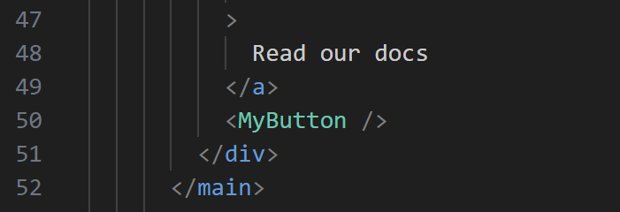
4. Simpan perubahan dan coba lihat perubahan melalui web browser!
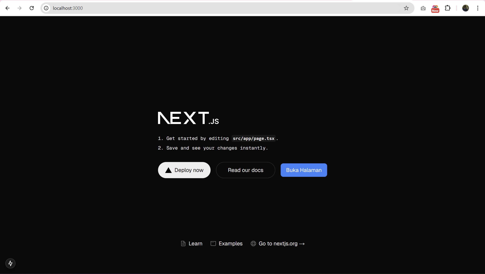

**Pertanyaan Praktikum 3**
1. Buktikan dengan screenshoot yang menunjukkan bahwa tahapan percobaan di atas telah
berhasil Anda lakukan!

## Praktikum 4: Menulis Markup dengan JSX
1. Tambahkan kode JSX di bawah ini ke dalam file page.tsx.
    ```
    function Profile() {
    return (
        <>
        <div className="text-xs">Developed by: {user.name}</div>
        
        </>
    );
    }
    const user = {
    name: 'Rhanilham Fadlillatul Ramadhan',
    imageUrl: 'https://i.imgur.com/yXOvdOSs.jpg',
    imageSize: 90,
    };
    ```
2. Tambahkan komponen MyProfile setelah kompnen MyButton.
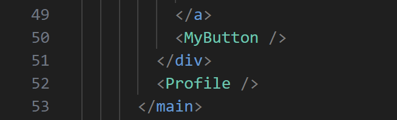
3. Simpan dan amati perubahan di halaman web yang dihasilkan!
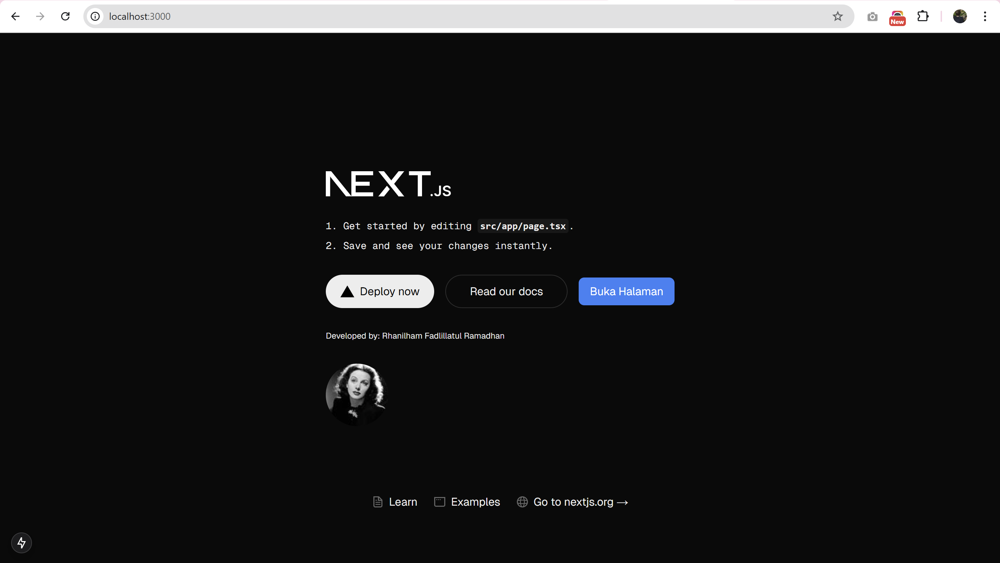

**Pertanyaan Praktikum 4**
1. Untuk apakah kegunaan sintaks user.imageUrl?

    Sintaks user.imageUrl digunakan untuk mengambil nilai properti imageUrl dari objek user, yang berisi URL gambar. Ini digunakan sebagai sumber gambar (src) dalam elemen .
2. Buktikan dengan screenshoot yang menunjukkan bahwa tahapan percobaan di atas telah
berhasil Anda lakukan!
