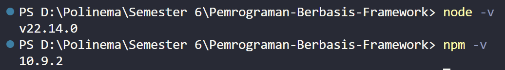
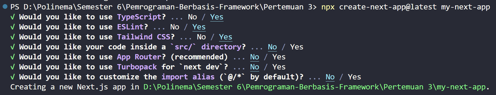
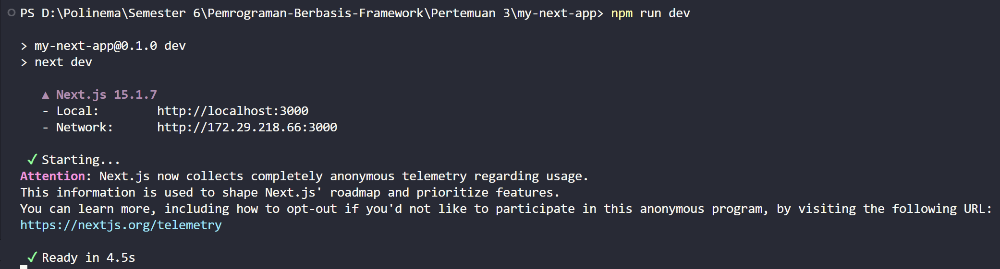
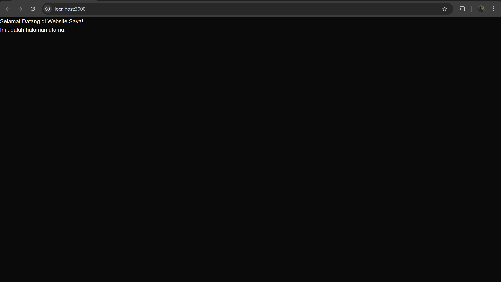
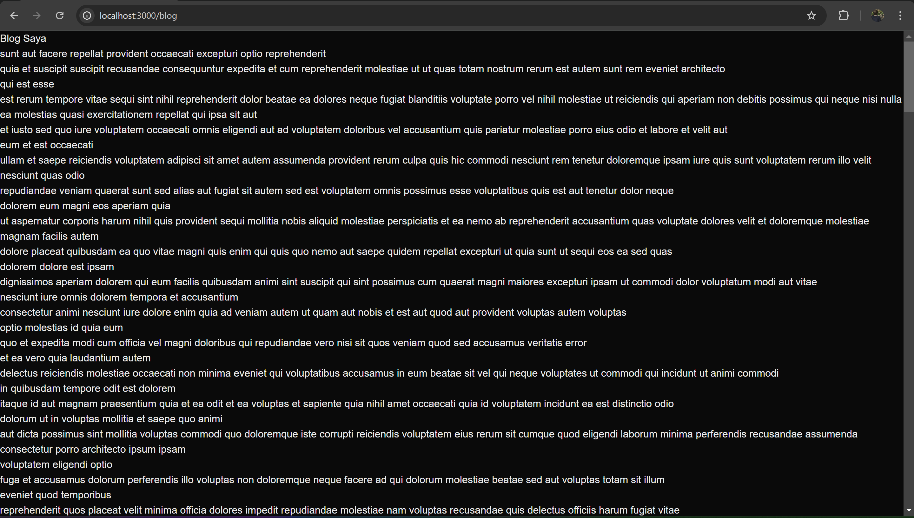
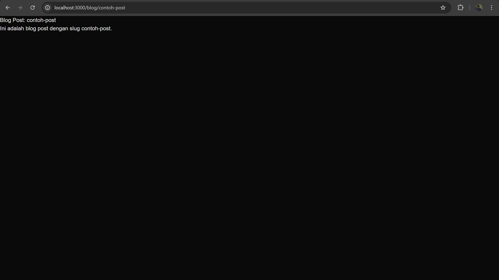
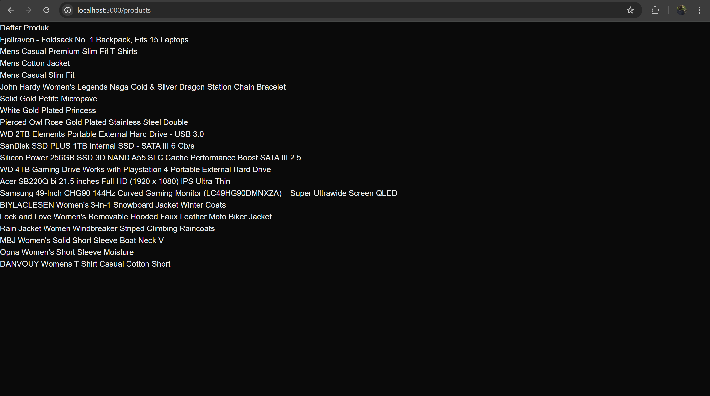
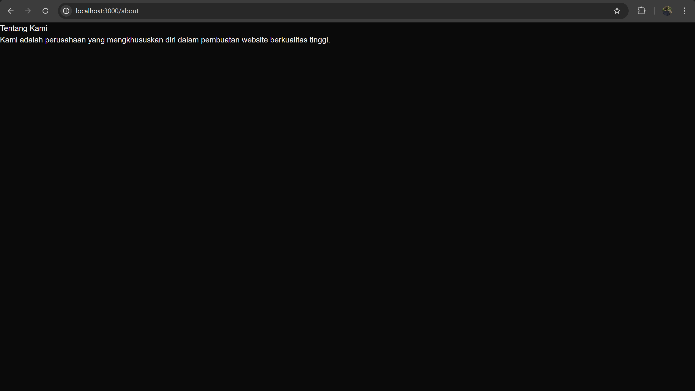

## Praktikum
**A. Persiapan Lingkungan**
1. Pastikan Node.js dan npm sudah terinstal di komputer Anda. Anda dapat memeriksanya dengan
menjalankan perintah berikut di terminal atau command prompt:

2. Buat direktori baru untuk proyek Next.js Anda
3. Inisialisasi proyek Next.js dengan menjalankan perintah berikut: Perhatikan bahwa App Router
belum digunakan

4. Jalankan aplikasi Next.js dengan perintah:
    
    Aplikasi akan terbuka di browser pada alamat http://localhost:3000.

**B. Membuat Halaman dengan Server-Side Rendering (SSR)**
1. Buka file pages/index.tsx di text editor Anda.
2. Ganti kode di dalamnya dengan kode berikut untuk membuat halaman sederhana:
    ```
    import React from "react";

    const HomePage = () => {
    return(
        <div>
        <h1>Selamat Datang di Website Saya!</h1>
        <p>Ini adalah halaman utama.</p>
        </div>
    );
    };

    export default HomePage;
    ```
3. Simpan file dan lihat perubahan di browser. Anda akan melihat halaman utama dengan teks
"Selamat Datang di Website Saya!"


**C. Menggunakan Static Site Generation (SSG)**
1. Buat file baru di direktori pages dengan nama blog.js.
2. Tambahkan kode berikut untuk membuat halaman blog dengan SSG:
    ```
    import React from 'react';

    const Blog = ({posts}) => {
        return (
            <div>
                <h1>Blog Saya</h1>
                {posts.map((post) => (
                    <div key={post.id}>
                        <h2>{post.title}</h2>
                        <p>{post.body}</p>
                    </div>  
                ))}
            </div>
        );
    };

    export async function getStaticProps() {
        const res = await fetch('https://jsonplaceholder.typicode.com/posts');
        const posts = await res.json();

        return{
            props: {
                posts,
            },
        };
    }

    export default Blog;
    ```
3. Simpan file dan buka http://localhost:3000/blog di browser. Anda akan melihat daftar post yang
diambil dari API eksternal.


**D. Menggunakan Dynamic Routes**
1. Buat direktori baru di pages dengan nama blog.
2. Buat file di dalam direktori blog dengan nama [slug].js
3. Tambahkan kode berikut untuk membuat halaman dinamis berdasarkan slug:
    ```
    import {useRouter} from 'next/router';

    const BlogPost = () => {
        const router = useRouter();
        const {slug} = router.query;
        
        return(
            <div>
                <h1>Blog Post: {slug}</h1>
                <p>Ini adalah blog post dengan slug {slug}.</p>
            </div>
        );
    };

    export default BlogPost;
    ```
4. Simpan file dan buka http://localhost:3000/blog/contoh-post di browser. Anda akan melihat
halaman yang menampilkan slug dari URL.


**E. Menggunakan API Routes**
1. Pastikan terdapat direktori di pages dengan nama api.
2. Buat file di dalam direktori api dengan nama products.js.
3. Tambahkan kode berikut untuk membuat API route yang mengembalikan daftar produk:
    ```
    export default async function handler(req, res){
        const response = await fetch('https://fakestoreapi.com/products');
        const products = await response.json();

        res.status(200).json(products);
    }
    ```
4. Buat file baru di pages dengan nama products.js untuk menampilkan daftar produk:
    ```
    import {useState, useEffect} from 'react';

    const ProductList = () => {
        const [products, setProducts] = useState([]);

        useEffect(() => {
            const fetchProducts = async () => {
                const response = await fetch('/api/products');
                const products = await response.json();
                setProducts(products);
            };
            fetchProducts();
        }, []);

        return (
            <div>
                <h1>Daftar Produk</h1>
                <ul>
                    {products.map((product) => (
                        <li key={product.id}>{product.title}</li>
                    ))}
                </ul>
            </div>
        );
    };

    export default ProductList;
    ```
5. Simpan file dan buka http://localhost:3000/products di browser. Anda akan melihat daftar
produk yang diambil dari API route.


**F. Menggunakan Link Component**
1. Buka file pages/index.tsx dan tambahkan modif dengan kode berikut untuk membuat link ke
halaman lain:
    ```
    import Link from 'next/link';

    const HomePage = () => {
    return (
        <div>
        <h1>Selamat Datang di  Website Saya</h1>
        <p>Ini adalah halaman utama.</p>
        <Link href="/about">
            Tentang Kami
        </Link>
        </div>
    );
    };

    export default HomePage;
    ```
2. Buat file baru di pages dengan nama about.js untuk halaman "Tentang Kami":
    ```
    const AboutPage = () => {
        return (
            <div>
                <h1>Tentang Kami</h1>
                <p>Kami adalah perusahaan yang mengkhususkan diri dalam pembuatan website berkualitas tinggi.</p>
            </div>
        )
    }

    export default AboutPage;
    ```
3. Simpan file dan buka http://localhost:3000 di browser. Klik link "Tentang Kami" untuk navigasi
ke halaman tentang.



## Tugas 
1. Buat halaman baru dengan menggunakan Static Site Generation (SSG) yang menampilkan daftar
pengguna dari API https://jsonplaceholder.typicode.com/users.
2. Implementasikan Dynamic Routes untuk menampilkan detail pengguna berdasarkan ID.
3. Buat API route yang mengembalikan data cuaca dari API eksternal (misalnya,
OpenWeatherMap) dan tampilkan data tersebut di halaman front-end.
