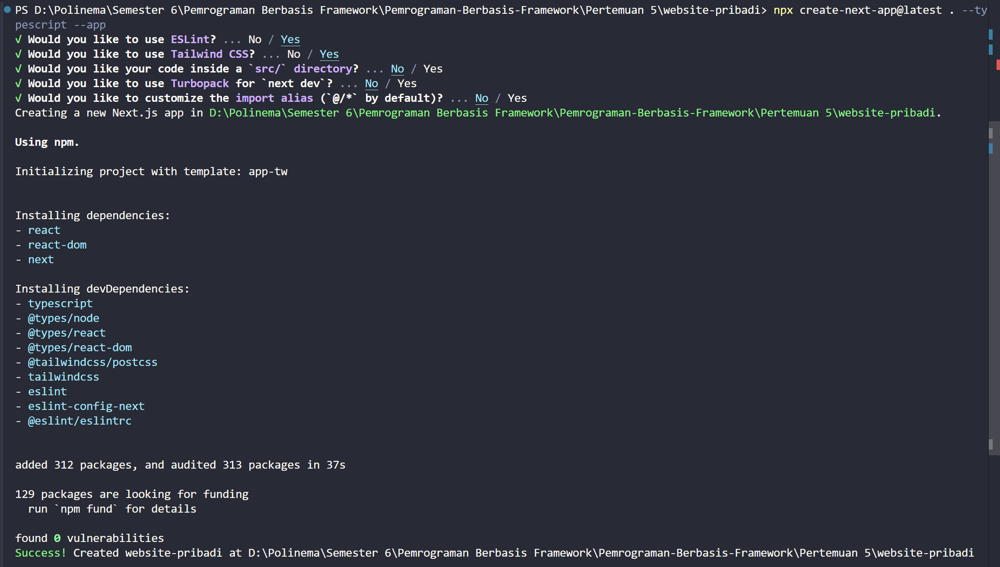
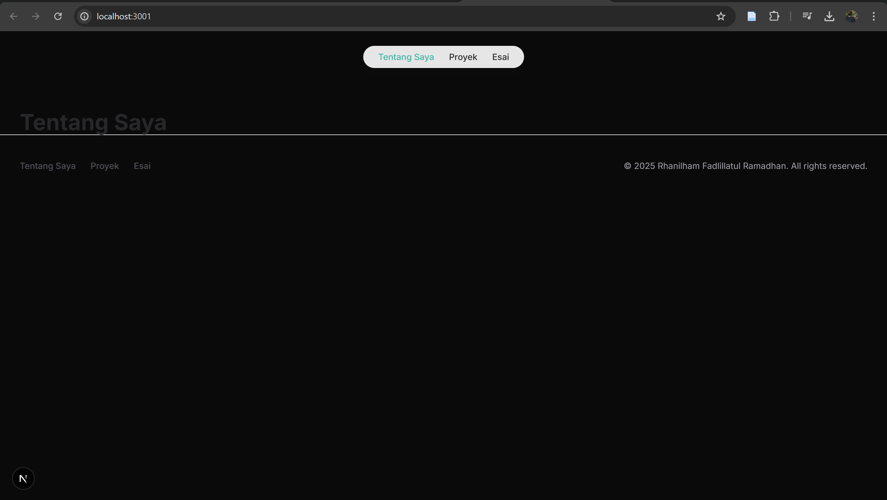
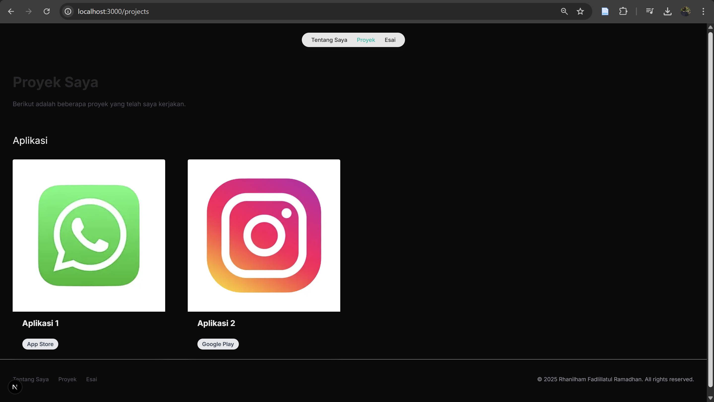

## Praktikum
**A. Persiapan Lingkungan**
1. Pastikan Node.js dan npm sudah terinstal di komputer Anda. Anda dapat memeriksanya dengan menjalankan perintah berikut di terminal atau command prompt:
    ```
    node -v
    npm -v
    ```
2. Buat direktori baru untuk proyek Next.js Anda: 
    ```
    mkdir website-pribadi
    
    cd website-pribadi
    ```
3. Inisialisasi proyek Next.js dengan TypeScript dan App Router:
    ```
    npx create-next-app@latest . --typescript –app
    ```
    
4. Cek konfigurasi postcss.config.mjs:
    ```
    const config = {
    plugins: ["@tailwindcss/postcss"],
    };

    export default config;
    ```
5. Cek di app/globals.css, sudah ada import untuk tailwindcss:
    ```
    @import "tailwindcss";

    :root {
    --background: #ffffff;
    --foreground: #171717;
    }

    @theme inline {
    --color-background: var(--background);
    --color-foreground: var(--foreground);
    --font-sans: var(--font-geist-sans);
    --font-mono: var(--font-geist-mono);
    }

    @media (prefers-color-scheme: dark) {
    :root {
        --background: #0a0a0a;
        --foreground: #ededed;
    }
    }

    body {
    background: var(--background);
    color: var(--foreground);
    font-family: Arial, Helvetica, sans-serif;
    }
    ```
6. Buka app/layout.tsx, tambahkan import './globals.css', dan modifikasi menjadi sebagai berikut:
    ```
    import Layout from '../components/layout';
    import './global.css'

    export default function RootLayout({
    children,
    }:{
    children: React.ReactNode
    }){
    return(
        <html lang='en'>
        <body>
            <Layout pageId="about_me">
            {children}
            </Layout>
        </body>
        </html>
    );
    }
    ```
7. Jalankan aplikasi Next.js:
    ```
    npm run dev
    ```
    Aplikasi akan terbuka di browser pada alamat http://localhost:3000.

**B. Membuat Halaman Website**

Website pribadi akan memiliki tiga halaman:
* Tentang Saya: Halaman berisi profil singkat dan link ke media sosial.
* Proyek: Halaman untuk menampilkan proyek-proyek yang telah diselesaikan.
* Esai: Halaman untuk menampilkan daftar artikel yang telah ditulis.

Langkah-langkah:
1. Buat file app/page.tsx sebagai halaman "Tentang Saya":
    ```
    export default function Home(){
    return <div>Tentang Saya</div>
    }
    ```
2. Buat file app/projects/page.tsx sebagai halaman "Proyek":
    ```
    export default function Projects(){
        return <div>Proyek</div>
    }
    ```
3. Buat file app/essays/page.tsx sebagai halaman "Esai":
    ```
    export default function Essays(){
        return <div>Esai</div>
    }
    ```
4. Buka browser dan akses:
    * http://localhost:3000/ untuk halaman "Tentang Saya".
    * http://localhost:3000/projects untuk halaman "Proyek".
    * http://localhost:3000/essays untuk halaman "Esai".

**C. Membuat Layout dan Navigasi**

Layout digunakan untuk menyediakan struktur yang konsisten di seluruh halaman, seperti navbar dan
footer.

Langkah-langkah:
1. Buat direktori src/components jika belum ada.
2. Buat file src/components/Layout.tsx:
    ```
    import Navbar from "./Navbar";
    import Footer from "./Footer";

    type LayoutProps = {
    children: React.ReactNode;
    };

    export default function Layout({ children }: LayoutProps) {
    return (
        <>
        <Navbar />
        <main>{children}</main>
        <Footer />
        </>
    );
    }
    ```
3. Buat file src/components/Navbar.tsx
    ```
    'use client';

    import { usePathname } from 'next/navigation';

    type NavItemProps = {
    title: string;
    url: string;
    isSelected: boolean;
    };

    function NavItem({ title, url, isSelected }: NavItemProps) {
    return (
        <li>
        <a
            className={`block px-3 py-2 transition hover:text-teal-500 ${isSelected ? 'text-teal-500' : ''}`}
            href={url}
        >
            {title}
        </a>
        </li>
    );
    }

    export default function Navbar() {
    const pathname = usePathname();

    return (
        <div className="flex justify-center mx-auto max-w-7xl h-16 pt-6">
        <nav>
            <ul className="flex rounded-full bg-white/90 px-3 text-sm font-medium text-zinc-800 shadow-lg shadow-zinc-800/5 ring-1 ring-zinc-900/5 backdrop-blur">
            <NavItem title="Tentang Saya" url="/" isSelected={pathname === '/'} />
            <NavItem title="Proyek" url="/projects" isSelected={pathname === '/projects'} />
            <NavItem title="Esai" url="/essays" isSelected={pathname === '/essays'} />
            </ul>
        </nav>
        </div>
    );
    }
    ```
4. Buat file src/components/Footer.tsx
    ```
    type FooterLinkProps = {
        text: string;
        url: string;
    };
    
    function FooterLink({ text, url }: FooterLinkProps) {
        return <a className="transition hover:text-teal-500" href={url}>{text}</a>;
    }
    
    export default function Footer() {
        return (
        <footer className="pt-10 px-8 pb-16 border-t">
            <div className="flex justify-between gap-6">
            <div className="flex gap-6 text-sm font-medium text-zinc-600">
                <FooterLink text="Tentang Saya" url="/" />
                <FooterLink text="Proyek" url="/projects" />
                <FooterLink text="Esai" url="/essays" />
            </div>
            <p className="text-sm text-zinc-400">© 2025 Rhanilham Fadlillatul Ramadhan. All rights reserved.</p>
            </div>
        </footer>
        );
    }
    ```
5. Update file app/layout.tsx untuk menggunakan layout:
    ```
    import type { Metadata } from 'next';
    import { Inter } from 'next/font/google';
    import './globals.css';
    import Layout from '../src/components/Layout';

    const inter = Inter({ subsets: ['latin'] });

    export const metadata: Metadata = {
    title: 'Website Pribadi',
    description: 'Website pribadi untuk menampilkan proyek dan esai.'
    };

    export default function RootLayout({
    children
    }: {
    children: React.ReactNode;
    }) {
    return (
        <html lang="en">
        <body className={inter.className}>
            <Layout>
            {children}
            </Layout>
        </body>
        </html>
    );
    }
    ```
6. Update setiap halaman menambahkan metadata dengan generateMetadata:
    ```
    import type { Metadata } from 'next';

    export const metadata: Metadata = {
    title: 'Tentang Saya',
    description: 'Halaman tentang saya.',
    openGraph: {
        title: 'Tentang Saya',
        description: 'Halaman tentang saya.',
    },
    };

    export default function Home() {
    return (
        <div className="mt-16 px-8">
        <header>
            <h1 className="font-bold text-4xl text-zinc-800">Tentang Saya</h1>
        </header>
        </div>
    );
    }
    ```
    Lakukan hal yang sama untuk halaman projects/page.tsx dan essays/page.tsx.
    ```
    import type { Metadata } from 'next';

    export const generateMetadata = (): Metadata => {
    return {
        title: 'Proyek',
        description: 'Halaman daftar proyek.',
        openGraph: {
        title: 'Proyek',
        description: 'Halaman daftar proyek.',
        },
    };
    };

    export default function Projects() {
    return (
        <div className="mt-16 px-8">
        <header>
            <h1 className="font-bold text-4xl text-zinc-800">Proyek</h1>
        </header>
        </div>
    );
    }
    ```
    ```
    import type { Metadata } from 'next';

    export const generateMetadata = (): Metadata => {
    return {
        title: 'Esai',
        description: 'Halaman kumpulan esai.',
        openGraph: {
        title: 'Esai',
        description: 'Halaman kumpulan esai.',
        },
    };
    };

    export default function Essays() {
    return (
        <div className="mt-16 px-8">
        <header>
            <h1 className="font-bold text-4xl text-zinc-800">Esai</h1>
        </header>
        </div>
    );
    }
    ```
    

**D. Membuat Halaman Proyek dengan Grid Responsif**

Halaman proyek akan menampilkan daftar proyek dalam bentuk grid yang responsif.

Langkah-langkah:
1. Buat folder di public/images. Kemudian tambahkan dua image, lalu rename dengan nama
project1.png dan project2.png
2. Modifikasi file app/projects/page.tsx:

    Tambahkan import next/image dan beberapa image yang telah ditambahkan sebelumnya
    ```
    import Image, { StaticImageData } from 'next/image';
    import image1 from '../../public/images/project1.png';
    import image2 from '../../public/images/project2.png';
    ```
    Buat card project item sebagai berikut:
    ```
    type ProjectItemProps = {
    name: string;
    url: string;
    urlDisplay: string;
    imageSrc: StaticImageData;
    };

    function ProjectItem({ name, url, urlDisplay, imageSrc }: ProjectItemProps) {
    return (
        <li>
        <a href={url}>
            <div className="max-w-sm rounded overflow-hidden shadow-lg">
            <Image className="w-full" src={imageSrc} alt={name} />
            <div className="px-6 py-4">
                <div className="font-bold text-xl mb-2">{name}</div>
            </div>
            <div className="px-6 pb-4">
                <span className="inline-block bg-gray-200 rounded-full px-3 py-1 text-sm font-semibold text-gray-700 mr-2 mb-2">
                {urlDisplay}
                </span>
            </div>
            </div>
        </a>
        </li>
    );
    }
    ```
    Modifikasi komponen project sebagai berikut:
    ```
    export default function Projects() {
    return (
        <div className="mt-16 px-8">
        <header>
            <h1 className="font-bold text-4xl text-zinc-800">Proyek Saya</h1>
            <p className="text-base mt-6 text-zinc-600">
            Berikut adalah beberapa proyek yang telah saya kerjakan.
            </p>
        </header>
        <div className="mt-16">
            <h2 className="text-2xl">Aplikasi</h2>
            <ul className="grid grid-cols-1 md:grid-cols-2 lg:grid-cols-4 gap-x-12 gap-y-16 mt-8">
            <ProjectItem
                name="Aplikasi 1"
                url="https://example.com"
                urlDisplay="App Store"
                imageSrc={image1}
            />
            <ProjectItem
                name="Aplikasi 2"
                url="https://example.com"
                urlDisplay="Google Play"
                imageSrc={image2}
            />
            </ul>
        </div>
        </div>
    );
    }
    ```
3. Simpan file dan buka http://localhost:3000/projects di browser. Anda akan melihat daftar proyek
dalam grid yang responsif.


## Tugas
Eksplorasi Tailwindcss, kemudian.
1. Modifikasi halaman "Esai" dengan Grid daftar artikel yang telah ditulis.
2. Modifikasi halaman “Tentang Saya” Buat tampilan yang menarik 